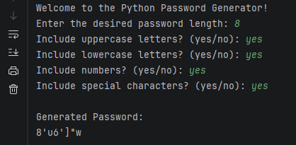

# Python Password Generator
## Program Screenshot



A Python program that generates secure random passwords based on user-selected criteria such as length, uppercase letters, lowercase letters, numbers, and special characters.

## Features

- User chooses password length
- Option to include uppercase letters
- Option to include lowercase letters
- Option to include numbers
- Option to include special characters
- Input validation for user responses

## Technologies Used

- Python
- random module
- string module

## How to Run

1. Download the file
2. Run the program in Python

```bash
python password_generator.py
```

## Example Use

The program asks the user:
- password length
- whether to include uppercase letters
- whether to include lowercase letters
- whether to include numbers
- whether to include special characters

It then generates a random password based on those choices.

## Author
Anthony Bowser Jr  
Computer Science Student  
Southern New Hampshire University
